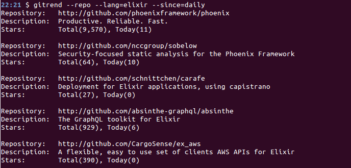

# trending

CLI to see what the GitHub community is most excited about today.

## Installation

#### Clone this repository

```bash
git clone git@github.com:wnuqui/trending.git
```

#### Build an escript for the repository

```bash
mix escript.build
```

#### Move the escript to bin folder

You can put `trending` escript, say for example, in `/usr/local/bin/`.

```bash
sudo cp trending /usr/local/bin
```

## Usage

Get latest trending Elixir repositories. Use `--repo` to explicitly get latest trending repositories.
```bash
trending --lang=elixir
```

Get latest trending Elixir developers.
```bash
trending --dev --lang=elixir
```

For more info use `--help` switch.
```bash
trending --help
```

## `trending` in action


